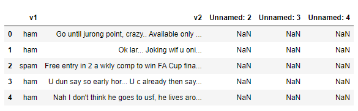
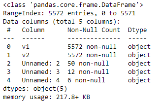
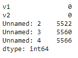
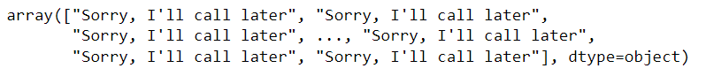
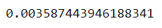

# Implementation-of-SVM-For-Spam-Mail-Detection

## AIM:
To write a program to implement the SVM For Spam Mail Detection.

## Equipments Required:
1. Hardware – PCs
2. Anaconda – Python 3.7 Installation / Moodle-Code Runner

## Algorithm
1. Import the necessary packages.
2. Read the given csv file and display the few contents of the data. 
3. Assign the features for x and y respectively.
4. Split the x and y sets into train and test sets.
5. Convert the Alphabetical data to numeric using CountVectorizer.
6. Predict the number of spam in the data using SVC (C-Support Vector Classification) method of SVM (Support vector machine) in sklearn library.
7. Find the accuracy of the model.

## Program:

Program to implement the SVM For Spam Mail Detection.
#### Developed by:  VINOD KUMAR S  
#### RegisterNumber: 212222240116

```python
#import packages
import pandas as pd
import matplotlib.pyplot as plt
df=pd.read_csv("spam.csv",encoding="latin-1")
df.head()

#checking the data information and null presence
df.info()
df.isnull().sum()

#assigning x and y array
x=df["v1"].values
y=df["v2"].values

#splitting the dataset
from sklearn.model_selection import train_test_split
x_train,x_test,y_train,y_test=train_test_split(x,y,test_size=0.2,random_state=0)

#converting to numerical count in train and test set
from sklearn.feature_extraction.text import CountVectorizer
cv=CountVectorizer()
x_train=cv.fit_transform(x_train)
x_test=cv.transform(x_test)

#predicting y- i.e detecting spam
from sklearn.svm import SVC
svc=SVC()
svc.fit(x_train,y_train)
y_pred=svc.predict(x_test)
y_pred

#checking the accuracy of the model
from sklearn import metrics
accuracy=metrics.accuracy_score(y_test,y_pred)
accuracy
```

## Output:
### Dataset:

### Dataset information:



### Detected spam:

### Accuracy score of the model:



## Result:
Thus the program to implement the SVM For Spam Mail Detection is written and verified using python programming.
